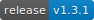

[](https://github.com/intelequia/dnn.powerbiembedded/releases) [](https://intelequia.visualstudio.com/DotNetNuke.PowerBI/_build/latest?definitionId=44)

# DNN Power BI Embedded module

A set of modules to embed Power BI Embedded dashboards and reports into a DNN Platform installation.

# Introduction

In business environments where you need to offer a business intelligence solution based on data, dashboards and reports, one of the first tools that comes to mind is [Power BI](https://powerbi.microsoft.com/). Then you realize that you would like those reports to be available embedded within your own application instead of having to license all users because of permissions and sharing restrictions.

It gets even more interesting when your application is used by thousands of users outside your organization. That's where [Power BI Embedded](https://powerbi.microsoft.com/en-us/power-bi-embedded/) comes into play. A service that allows you to publish Power BI portal resources under your premises, being able to fully customize the user experience.

The DNN Power BI Embedded module allows you to embed Power BI reports and dashboards into your DNN website and secure the access to the reports by using DNN users and roles, including role security level and lots of rich features without the need of coding the Power BI Embedded integration. The module is available on English, Spanish and German.

## Requirements
* **DNN Platform 9.4.3 or later**
* Power BI account for development and test
* Power BI Embedded deployment in an active Azure subscription for production workspaces. 

## Resources
* **DEMO VIDEO**: For a quick overview, check this [demo video](https://www.youtube.com/watch?v=kZzKFqyt88w). 
* **Documentation**: for the full project documentation, please refer the [Wiki](https://github.com/intelequia/dnn.powerbiembedded/wiki)
* **RLS Configuration**: For detailed information about configuring Role Level Security, see the [RLS Configuration Guide](docs/RLS-Configuration.md)

## Architecture
Reference architecture of a DNN portal deployed on Azure, using App Service and SQL Database under platform as a service. The module is compatible with the use of [Azure AD](https://github.com/davidjrh/dnn.azureadprovider), [Azure AD B2C](https://github.com/intelequia/dnn.azureadb2cprovider) or other authentication providers. Report usage information is sent to Application Insights if the [DNN Application Insights module](https://github.com/davidjrh/dnn.appinsights) is also installed. 


## Screenshots


# Building the solution
### Requirements
* Visual Studio 2022 (download from https://www.visualstudio.com/downloads/)
* npm package manager (download from https://www.npmjs.com/get-npm)

### Install package dependencies
From the command line, enter the `<RepoRoot>\DotNetNuke.PowerBI\PBIEmbedded.Web` and run the following commands:
```
  npm install -g webpack
  npm install -g webpack-cli
  npm install -g webpack-dev-server --force
  npm install --force
```
### Debug the client side app
To debug the client side, build the module in debug mode and copy the .dll and .pdb files into your site /bin folder (you can tweak the post build event for such purpose). That will try to load the persona bar bundle script from https://localhost:8080. 

The second step is to start the local webpack dev server. To do it, 
From the command line, enter the `<RepoRoot>\DotNetNuke.PowerBI\PBIEmbedded.Web` and run the following commands:
```
  webpack-dev-server
```

### Build the module
Now you can build the solution by opening the file `DotNetNuke.PowerBI.sln` in Visual Studio. Building the solution in "Release", will generate the React bundle and package it all together with the installation zip file, created under the "\releases" folder.
#### Known issues
**Problem**: When building the module on Release mode, you get an error message "error:0308010C:digital envelope routines::unsupported". 
*Solution*: This can be caused when using newer versions of Node, with the OpenSSL plugin (see https://stackoverflow.com/questions/69692842/error-message-error0308010cdigital-envelope-routinesunsupported). The recommended solution is to set an environment variable `set NODE_OPTIONS=--openssl-legacy-provider`
